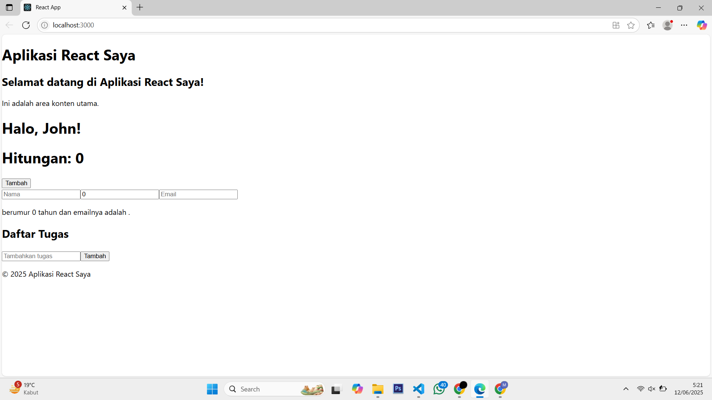

## Laporan Praktikum

|  | Pemrograman Berbasis Framework 2025 |
|--|--|
| NIM |  244107027015|
| Nama |  Muhamad Saifulloh Bahroin Gana Perkasa |
| Kelas | TI - 4K |

### Tugas

1. Buat komponen baru bernama TodoList yang menampilkan daftar tugas (todo list). Gunakan
state untuk mengelola daftar tugas dan props untuk mengirim data tugas ke komponen anak.

2. Tambahkan fitur untuk menambahkan tugas baru ke dalam daftar menggunakan form input.

## Jawaban

